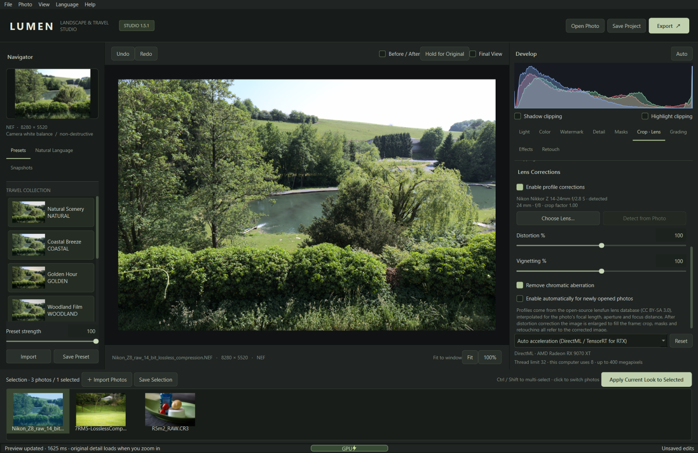
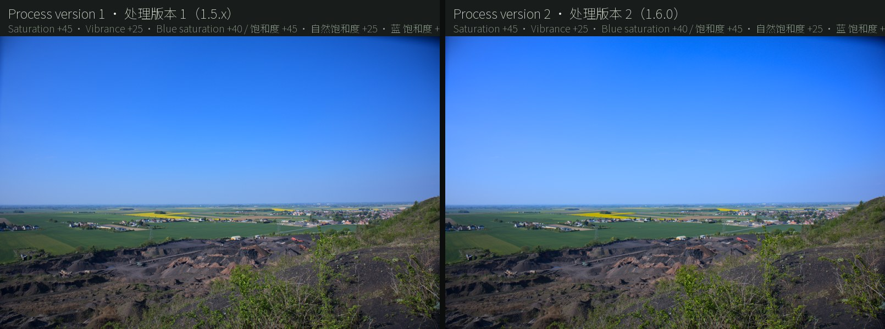
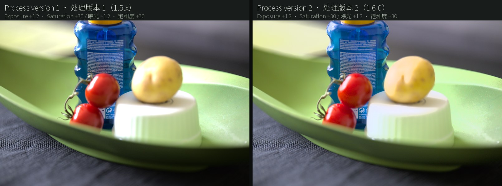
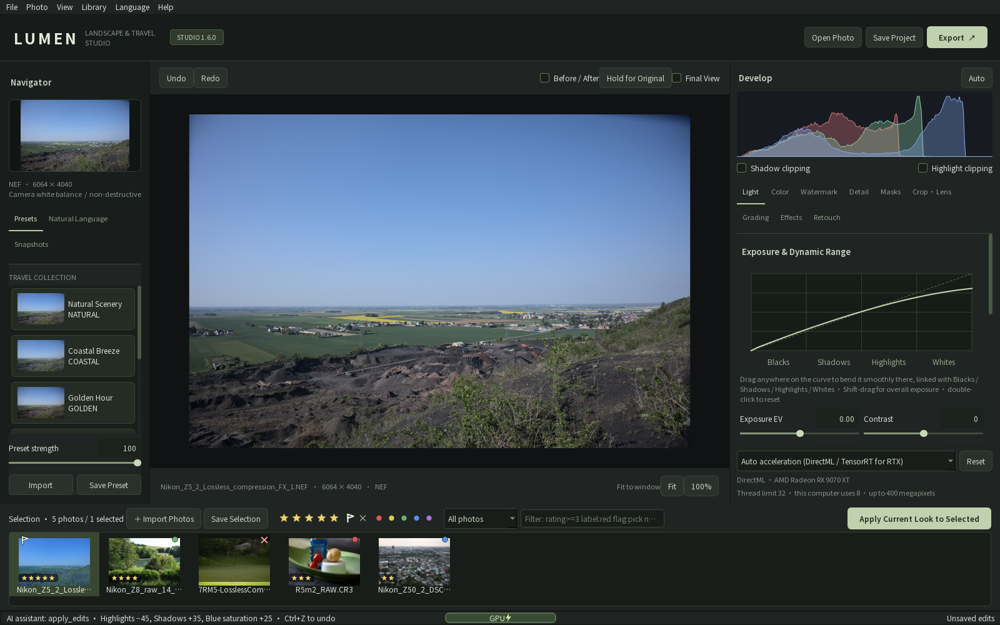

# LUMEN RAW

**An open-source RAW photo editor: color grading, lens corrections, AI enhancement, smart masks, photo merging — and editing by describing the look in one sentence.**

[中文说明](README.zh-CN.md) · [Downloads](https://github.com/hety0211/lumen-raw/releases) · [Changelog](CHANGELOG.md) · [Contributing](CONTRIBUTING.md) · [MIT license](LICENSE)

LUMEN RAW is a local desktop editor for landscape and travel photography on Windows and Apple silicon Macs. No account is required. The interface is available in nine languages: English, 简体中文, 繁體中文, 日本語, 한국어, Deutsch, Français, Español and Русский. Opening, editing, lens corrections, AI denoising / super-resolution / masks and export all run offline on your computer. The network is used only when you choose a cloud language model for natural-language editing.

Current version: Windows **1.6.0** (2026-10-10), macOS **1.5.2** (2026-10-08).



Actual application screenshot with CC0 public test photographs from raw.pixls.us ([image credits](docs/screenshots/README.md)).

## Download and install

| System | Download | Requirements |
|---|---|---|
| Windows | [`LumenRAW-1.6.0-Setup.exe` (installer) or `LumenRAW-1.6.0-Windows.zip` (portable)](https://github.com/hety0211/lumen-raw/releases/tag/v1.6.0) | Windows 10 22H2 / Windows 11, x64 |
| macOS | [`LumenRAW-1.5.2-macOS-arm64.dmg`](https://github.com/hety0211/lumen-raw/releases/tag/v1.5.2-macos) | Apple silicon (M1 or newer), macOS 15 Sequoia or later |

1.6.0 is Windows only for now: process version 2, ratings and AI assistant access are not in the Mac build 1.5.2, and projects (`.lumen`) and albums (`.lumenalbum`) saved by 1.6.0 cannot be opened by 1.5.2; projects from 1.5.2 and earlier work on both. Each release lists SHA-256 checksums. The binaries are not code-signed with a commercial certificate.

**Windows**

- **Installer:** installs for the current user without administrator rights and upgrades 1.2.x – 1.5.2 in place. Save your album and close the old version first. The language you choose when the installer starts becomes the interface language; change it later in the **Language** menu.
- **Portable:** extract and run `LumenRAW-Windows\LumenRAW.exe`. Keep the `_internal` folder next to the exe. The portable build follows the system language until you choose one.
- Both include Python, ExifTool, fonts, the nine AI models, the speech model and the lensfun lens database, and work fully offline.

**macOS**

- Open the DMG and drag **LUMEN RAW** to Applications (replacing an older copy).
- The interface starts in the first supported language of System Settings → General → Language & Region (or the language set for LUMEN RAW under Applications there); change it in the **Language** menu. The 1.5.0 Mac build was Chinese-only, so a Mac whose first language is English now starts in English.
- The app is ad-hoc signed and not notarized by Apple, so the first launch is blocked. Open System Settings → Privacy & Security and click **Open Anyway**, or run `xattr -dr com.apple.quarantine "/Applications/LUMEN RAW.app"`.
- The first voice instruction asks for microphone access. Speech is recognized on the Mac and never uploaded.
- Cloud API keys are kept in the login keychain. After each update, macOS asks once whether the new build may read them; choose **Always Allow**.

## Features

- **Scene-referred color (1.6.0):** process version 2 keeps colors outside sRGB through the RAW decode, computes exposure, white balance and highlights / shadows in linear light (highlights / shadows as halo-free local tone mapping), works saturation, the color mixer and grading in OkLCh, and maps colors beyond sRGB keeping hue and lightness. Older projects look unchanged. See [Color and process versions](#color-and-process-versions).
- **Ratings (1.6.0):** stars, pick / reject flags and color labels with Lightroom's shortcuts and a field search; saved automatically, interchanged with XMP, importable from Lightroom catalogs. See [Ratings and filters](#ratings-and-filters).
- **AI assistants and command line (1.6.0):** Claude Code, Codex, WorkBuddy and other local assistants drive LUMEN RAW over MCP (visible in the window, undoable); `lumen-cli` renders from scripts. See [AI assistants (MCP) and the command line](#ai-assistants-mcp-and-the-command-line).
- **Lens corrections (1.5.1):** the lens is identified from EXIF and its distortion, vignetting and lateral chromatic aberration (purple / green edge fringes) are corrected with the open-source lensfun database. See [Lens corrections](#lens-corrections).
- **Nine interface languages (1.5.1):** switch any time from the **Language** menu; the installer offers the same languages.
- **Edit in one sentence (1.5):** type or say the look you want; a local or cloud language model of your choice returns the parameters, applied as one undoable step. See [Natural-language editing](#natural-language-editing).
- **RAW formats:** Sony ARW / SR2 / SRF, Canon CRW / CR2 / CR3, Nikon NEF / NRW, Fujifilm RAF (including X-Trans), Panasonic RW2, DNG and other formats supported by the bundled LibRaw, plus JPEG / PNG / TIFF. Nikon "High Efficiency" NEFs that LibRaw cannot decode open from their full-size embedded JPEG. For the Nikon Z50 II and Z5 II, which the bundled LibRaw does not list, LUMEN RAW supplies the colour matrix of their lossless NEFs.
- **Non-destructive development:** exposure, contrast, highlights / shadows / whites / blacks, an exposure curve you can bend anywhere, white balance (camera-recorded temperature and an eyedropper), 8-color HSL, RGB and per-channel curves, three-way color grading, monochrome, vignette and grain. Landscape and travel presets with adjustable strength (importable and exportable), auto adjust, snapshots, undo / redo.
- **Detail and retouching:** dehaze, clarity, texture, sharpening, luminance and color noise reduction; spot healing and clone stamp.
- **Masks:** brush, linear and radial gradients, luminance range, similar-color selection, and local AI models for sky, people, subject, background and foreground. Invert, feather, opacity and brush refinement; up to 32 masks per photo.
- **AI enhancement:** Real-ESRGAN 2× / 4× super-resolution and DRUNet / NAFNet / FFDNet denoising, each with its own preview dialog. Results are saved as editable DNG copies.
- **Photo merging:** focus stacking, HDR stacking (Mertens exposure fusion with three deghosting levels) and panoramas up to 200 megapixels, from 2–32 photos.
- **Culling and batches:** import many photos at once, multi-select in the filmstrip with Ctrl / Shift, copy the current edit to the selection, or batch-export JPEG / PNG / TIFF / DNG with an optional long-edge size.
- **Large images:** 100% view of original pixels, rendering only what is on screen. Editing a zoomed 61-megapixel photo keeps GUI stalls to about 40 ms. Before / after, hold-for-original and clipping warnings.
- **Watermarks and export:** four border styles with shooting information. Export JPEG / PNG (8-bit), TIFF (16-bit) and linear DNG (16-bit), up to 400 megapixels.

## Lens corrections

**Lens Corrections** sits below the crop tools in the right-hand **Crop · Lens** panel:

1. When a photo opens, the camera, lens model, focal length, aperture and focus distance from EXIF are matched against the lensfun database (1,569 lenses, 1,057 cameras). The panel shows the profile it found and which corrections the profile contains.
2. Tick **Enable profile corrections**. **Distortion %** and **Vignetting %** range from 0 to 200 %; **Remove chromatic aberration** can be turned off on its own.
3. If no lens is found or EXIF is incomplete, **Choose Lens…** searches by maker or model (by default only lenses that fit the body's mount); **Detect from Photo** returns to automatic. **Enable automatically for newly opened photos** turns corrections on for every photo you open from then on.

- The correction is interpolated between the database's calibrations for the photo's focal length, aperture and focus distance, and scaled for the body's crop factor; APS-C crop mode on a full-frame body is recognized from the 35 mm equivalent focal length in EXIF. Profiles calibrated for a smaller format are not used on larger images.
- Corrections come first in the pipeline: vignetting is corrected in linear light, and after distortion correction the image is enlarged so no empty corners remain. Crop, masks, retouching, the white-balance eyedropper and AI masks all work on the corrected image; hold-for-original and before / after show the uncorrected original.
- Corrections are saved with the project and applied to export, batch export and the zoomed view. **Apply Current Look to Selected** copies the correction switches and amounts; each photo gets the profile for its own EXIF.
- The lensfun models are implemented in LUMEN RAW itself (the lensfun library is not linked) and were checked against lensfun's own results: chromatic-aberration sample positions agree to within 0.002 px.

## Natural-language editing


The **Natural Language** tab sits between presets and snapshots in the left panel:

1. Click **Settings**, pick a service (table below) and enter a model name. **Get Model List** lists the server's models; **Test Connection** tests the connection.
2. Type a sentence such as "bluer sky with more depth, a little warmer, brighter shadows" and press Enter or **One-click Edit**. A list of example instructions is built in.
3. The model's explanation and every parameter change appear below. **Strength %** blends the result from 0 to 150 %, **Undo This Edit** reverts it, and **Regenerate** asks again from the same starting point. The last three turns are kept per photo, so "a bit warmer still" works.

The model can set 16 global sliders (exposure, contrast, highlights, shadows, whites, blacks, temperature, tint, saturation, vibrance, dehaze, clarity, texture, sharpening, luminance and color noise reduction), 8-color HSL, color grading, vignette and grain, monochrome, an RGB curve, and sky / subject / people / background / foreground AI masks or gradient masks. Every returned value is validated and clamped, so a reply can never produce an invalid project. Instructions can be written in any language; the model answers in the language of the instruction.

| Kind | Services | Notes |
|---|---|---|
| Local | Ollama, LM Studio, llama.cpp (llama-server), vLLM / Jan / LocalAI and other OpenAI-compatible servers | No API key; nothing leaves your computer |
| Cloud | OpenAI, Anthropic Claude, Google Gemini, DeepSeek, Alibaba Cloud Model Studio (Qwen), Kimi, Zhipu GLM, SiliconFlow, Volcano Engine Ark (Doubao), OpenRouter, custom endpoint | Your own API key, billed by the provider |

- **What is sent:** the instruction, the current edit, brightness / color statistics of the photo and shooting data (camera, lens, aperture, shutter, ISO, focal length, time — no GPS). Optionally one 768-pixel preview image for models that accept images.
- **API keys** stay on your computer: encrypted with Windows DPAPI for the current user, or in the macOS keychain.
- **Thinking depth:** default / off / low / medium / high / max, translated into each provider's own parameter and dropped automatically if a server rejects it. Low or off is usually enough: with LM Studio and qwen3-14b on an RX 9070 XT, one edit took 11.3 s by default and 1.6 s with thinking off. The first request after loading a model is slower.
- **Usage:** the status line shows the tokens of each edit, about 2,400. One DeepSeek (deepseek-flash) connection test plus one edit used 2,486 tokens and cost under ¥0.01. Attaching the preview, follow-up turns or other models change this; your provider's bill is authoritative.
- **Voice:** click **Voice** or press `Ctrl+Shift+Space` (`⌘⇧Space` on a Mac), speak, and pause for about a second; the recognized text is sent automatically (can be turned off in Settings). The bundled SenseVoice-Small model recognizes Chinese, English and mixed speech offline, about 0.1 s for 6 s of speech.

## Color and process versions

Photos opened in 1.6.0 use **process version 2 (scene-referred)**; projects and selections saved before keep process version 1 and look exactly as before. The Light panel shows the version under the develop start; **Upgrade** switches an older photo to version 2 (values stay, the picture changes, undoable).

- **Unclipped decode:** LibRaw only white-balances and demosaics; the camera-to-sRGB matrix is applied in floating point, so colors outside sRGB (sunsets, flowers, neon) survive until the end of the pipeline.
- **Tone in linear light:** exposure, temperature / tint and highlights / shadows / whites / blacks come before the develop curve, which then acts as the tone map on luminance. Lowering exposure or highlights brings back gradation the camera curve had compressed.
- **Local tone mapping:** highlights / shadows follow an edge-aware base luminance (a fast guided filter of log luminance), so texture inside the sky or the shadows keeps its contrast, strong edges get no halo, and large highlight pulls no longer turn the picture flat.
- **OkLCh color:** saturation, vibrance, the 8-color mixer, monochrome and grading work in perceptually uniform OkLCh: a more saturated blue sky does not drift purple or change lightness; monochrome keeps perceived lightness; grading changes color only, and works on monochrome photos too.
- **Highlight shoulder and gamut mapping:** the camera-referenced curve continues into a filmic shoulder near white, so luminance pushed past white rolls off smoothly; colors outside sRGB keep their hue and mainly lose chroma (too-bright saturated colors give up a little lightness), instead of being clipped per channel.
- On Windows, process version 2 runs on DirectML: a 1600-pixel preview takes about 50–60 ms on an RX 9070 XT, about 0.65 s in CPU mode.





## Ratings and filters



In the filmstrip toolbar and on the thumbnails:

| Action | Key |
|---|---|
| 0–5 stars | `0`–`5` |
| Pick / reject / unflag | `P` / `X` / `U` |
| Red / yellow / green / blue label (again to clear) | `6` / `7` / `8` / `9` |

- Applies to the selected photos in the filmstrip (or the current photo); the context menu and the **Library** menu have the same actions.
- **Saved automatically:** ratings live in `catalog.jsonl` in the data folder, an append-only log: every change is on disk at once, survives a crash, and needs no saving. Selections (`.lumenalbum`) carry a copy.
- **Filters:** quick filters (picked, not rejected, ★3 and up, …) or a field search: `rating>=3 -flag:reject label:red name:DSC0* ext:arw folder:2024 edited` (a leading `-` excludes; all terms must match).
- **XMP:** importing reads star ratings and labels from XMP sidecars (`name.xmp`) or embedded XMP, so ratings from Lightroom, Bridge or the camera appear. The **Library** menu writes ratings to XMP sidecars, optionally on every change (off by default). Only sidecars are written, never the photo; reject is written as Rating −1, as Lightroom does.
- **From Lightroom:** **Library → Import Ratings from a Lightroom Catalog…** reads a Lightroom Classic `.lrcat` read-only and imports stars, pick / reject flags and color labels (virtual copies skipped), optionally adding the photos found to the filmstrip.

## AI assistants (MCP) and the command line

Every operation of LUMEN RAW is a command with a stable id and JSON parameters (`edit.apply`, `library.rate`, `photo.export`, …). The rating controls, the command palette (`Ctrl+K`), the command line and the MCP server all dispatch through the same layer.

**Let an AI assistant work in LUMEN RAW:** **Help → AI Assistants (MCP)** shows ready-to-copy setups:

```
claude mcp add lumen-raw -- "%LOCALAPPDATA%\Programs\LUMEN RAW\lumen-cli.exe" mcp
codex mcp add lumen-raw -- "%LOCALAPPDATA%\Programs\LUMEN RAW\lumen-cli.exe" mcp
```

WorkBuddy, Claude Desktop and other clients take a JSON entry (`"command"`: the full path of `lumen-cli.exe`, `"args": ["mcp"]`). Then ask, for example: "apply the Golden preset to the photos rated three stars or more in this folder, darken the sky a little and export them to the desktop".

- **With LUMEN RAW open:** the assistant works in the window through a local control channel (a named pipe only your user can open); every step is visible and `Ctrl+Z` undoes it. The status bar and the AI Assistants window list recent actions; window control can be switched off there.
- **With LUMEN RAW closed:** the assistant opens, edits, renders and exports photos in the background, continuing from a `.lumen` project next to a photo; nothing is written until it saves a project or exports.
- **Tools (25):** open photos, read / apply edits (the natural-language editing vocabulary, including AI region masks such as sky and subject), undo / redo, auto tone, presets, copy edits, stars / flags / labels, render a preview (a JPEG image the assistant can look at), export, batch export, save projects, and more.
- **Protocol:** stdio; MCP 2026-07-28 (no handshake) and 2024-11-05 to 2025-11-25 (`initialize`).

**Command line:**

```
lumen-cli render DSC0001.ARW out.jpg --size 2560 --preset Golden --set exposure=0.3 --set hsl.blue.saturation=20
lumen-cli render trip.lumen out.tif
lumen-cli rate *.ARW 4
lumen-cli list "rating>=3 -flag:reject"
lumen-cli run edit.apply "{\"changes\": {\"adjustments\": {\"highlights\": -40}}}"
lumen-cli commands
```

`run` executes in the open window when there is one (`--headless` never does). Results are JSON; from source use `python main.py --cli …`.

## Interface languages

- The **Language** menu at the top offers English, 简体中文, 繁體中文, 日本語, 한국어, Deutsch, Français, Español and Русский. After choosing one, LUMEN RAW offers to restart; unsaved edits are offered for saving first.
- The Windows installer asks for the same nine languages and writes the choice to the settings, so the first start uses it; after a change in the app, the next installer run preselects that language. Without a setting, the interface follows the system language.
- Japanese, Korean and Traditional Chinese use the system's fonts for those scripts; Latin and Cyrillic text uses the system interface font.

## Workflow

1. **Import:** **Open Photo** or drag photos onto the window; several at once go to the filmstrip.
2. **Start:** pick a preset, click **Auto**, or describe the look in words; enable lens corrections in **Crop · Lens** if you want them.
3. **Adjust:** the nine right-hand panels are Light, Color, Watermark, Detail, Masks, Crop · Lens, Grading, Effects and Retouch. Type values directly; double-click a slider track to reset it.
4. **Check:** click **100%** or scroll to zoom, `Y` for before / after, `J` for clipping.
5. **Save:** `Ctrl+S` saves the current photo's `.lumen` project; **Save Selection** saves every photo in the filmstrip to a `.lumenalbum`. Both reference your originals, which are never modified — keep them together.
6. **Export:** export re-reads the full-resolution original and applies every edit; for several photos, multi-select in the filmstrip and right-click **Batch Export**.

| Action | Windows | macOS |
|---|---|---|
| Open / save project / export | `Ctrl+O` / `Ctrl+S` / `Ctrl+E` | `⌘O` / `⌘S` / `⌘E` |
| Undo / redo | `Ctrl+Z` / `Ctrl+Shift+Z` | `⌘Z` / `⌘⇧Z` |
| Fit to window | `Ctrl+0` | `⌘0` |
| Voice instruction | `Ctrl+Shift+Space` | `⌘⇧Space` |
| Before / after, clipping | `Y` / `J` | `Y` / `J` |
| Confirm crop, leave the white-balance picker | `Enter` / `Esc` | `Enter` / `Esc` |
| Clone source | `Alt`-click | `Option`-click |
| Pan / zoom | middle-drag / wheel | two-finger scroll / pinch or wheel |
| Stars / flags / labels | `0`–`5` / `P` `X` `U` / `6`–`9` | same |
| Command palette | `Ctrl+K` | `⌘K` |

## GPU acceleration

| Work | Windows | macOS |
|---|---|---|
| Pointwise development (white balance, exposure, tone, HSL, curves, grading, monochrome, ...) | DirectML | Metal |
| AI models (super-resolution, denoising, automatic masks) | NVIDIA RTX 30-series or newer on Windows 11 24H2+: TensorRT for RTX; other GPUs: DirectML | Core ML (Apple GPU) |
| RAW decoding, lens corrections, dehaze, clarity, texture, sharpening, classic noise reduction, retouching, merging | CPU (up to 32 threads) | CPU |

- GPU results are checked against the CPU on first use, with automatic fallback to the CPU. The bottom bar shows `GPU⚡` or `CPU⚡ (thread count)`; hover for the device and any fallback reason.
- AI models run in a separate process: a GPU driver crash does not close the editor; the work is retried on the next device and the GPU + driver combination is remembered.
- TensorRT for RTX is downloaded once by Windows on first use and then works offline.
- `LUMEN_COMPUTE=cpu` forces the CPU. On a Mac, `LUMEN_COREML_UNITS=ALL` also lets Core ML use the Neural Engine.
- Tested on an AMD Radeon RX 9070 XT (DirectML), a community GeForce RTX 5080 (TensorRT for RTX) and an M1 Pro. On the M1 Pro, pointwise development of a 1600-pixel preview takes about 3–5 ms, and super-resolution and denoising run 8–10× faster than on the CPU. Lens corrections add about 0.1 s to a 1600-pixel preview, recomputed only when the correction changes.

## Files and privacy

| What | Windows | macOS |
|---|---|---|
| Logs | `%LOCALAPPDATA%\LUMEN RAW\logs` | `~/Library/Logs/LUMEN RAW` |
| Interface language and lens defaults (`settings.ini`), natural-language settings, GPU compatibility record | `%LOCALAPPDATA%\LUMEN RAW` | `~/Library/Application Support/LUMEN RAW` |
| API keys | in the settings file, DPAPI-encrypted | login keychain ("LUMEN RAW") |
| Rating catalog (`catalog.jsonl`), command-line log | `%LOCALAPPDATA%\LUMEN RAW` | `~/Library/Application Support/LUMEN RAW` |

- Originals are read-only. Edits live in `.lumen` / `.lumenalbum` files; AI and merge results are saved as new DNG files. Removing a photo from the filmstrip does not delete it from disk.
- The app goes online only when you edit with a cloud model, and when Windows downloads TensorRT for RTX the first time. Running from source also downloads the runtime assets once. The lens database is bundled; identifying lenses needs no network.
- No official camera or lens brand logos are bundled; watermark brand names use ordinary fonts, and you can import logos you have the right to use.

## Limits

- **Lens corrections:** only lenses with calibration data in the lensfun database can be corrected; some profiles contain distortion but no vignetting or chromatic aberration, which the panel notes. Zoom lenses need a recorded focal length, and vignetting interpolation needs the aperture. Fisheye lenses are corrected within their own projection, not converted to rectilinear. There is no perspective (keystone) correction. Embedded camera JPEGs and photos already corrected in camera may be corrected twice — turn corrections on only where needed.
- **AI scope:** AI super-resolution and denoising work on developed RGB, not on sensor data, and are not Adobe's RAW enhancement. Super-resolution can invent texture, so preview first.
- **DNG output:** exported DNGs contain edited 16-bit linear RGB, not a lossless copy of the sensor mosaic. Keep your originals and projects.
- **Automatic masks:** hair, branches and translucent objects are not segmented precisely, and "background" needs a clear subject. Check the purple overlay and refine with the brush.
- **Merging:** panoramas need about 30 % overlap, shot around one viewpoint; parallax, motion or repeating texture can leave seams. HDR is Mertens exposure fusion, not radiance HDR. Merging has so far been tested with controlled views derived from single photos; real captured sequences still need more validation.
- **Size and resources:**
  - Exports, including watermark borders and 2× / 4× super-resolution, are capped at 400 megapixels.
  - Large images need plenty of memory and temporary disk space (32 GB RAM recommended), and high-quality AI on the CPU can be slow.
  - Up to 32 masks and 500 retouch strokes per photo.
- **Color:** 8-bit input is converted to sRGB via its ICC profile; 16-bit PNG / TIFF are treated as sRGB. There are no camera color profiles or display soft-proofing, and fully clipped highlights cannot always be recovered.
- **Languages:** changing the interface language needs a restart. Translations other than Simplified Chinese were made by the developers; corrections from native speakers are welcome.
- **Not supported:** Lightroom develop settings and XMP presets are not read (only ratings, flags and labels are imported). Exports do not copy the original's full EXIF / GPS.
- **Tested cameras:** Sony A7 III, A7R V; Canon EOS R, R5 Mark II, Rebel SL1; Nikon Z 6, Z8, Z50 II, Z5 II; Fujifilm X-T2; Panasonic DC-S1. Other models and compressions depend on LibRaw.

## Run from source

The repository holds the code, tests, the lensfun lens database, model provenance and licenses. AI models, fonts, ExifTool and the speech model are downloaded once by `tools/fetch_assets.py` (about 830 MB), which checks every file's SHA-256; editing then works offline.

**Windows** (Python 3.12 x64):

```powershell
git clone https://github.com/hety0211/lumen-raw.git
cd lumen-raw
py -3.12 -m venv .venv
.\.venv\Scripts\python.exe -m pip install -r requirements.txt
.\.venv\Scripts\python.exe tools/fetch_assets.py
.\.venv\Scripts\python.exe main.py
```

For GPU acceleration, switch ONNX Runtime to the Windows ML build (DirectML included; TensorRT for RTX on RTX GPUs):

```powershell
.\.venv\Scripts\python.exe -m pip uninstall -y onnxruntime
.\.venv\Scripts\python.exe -m pip install -r requirements-directml.txt
```

`fetch_assets.py --archive <zip>` installs from an already downloaded asset ZIP; `--verify-only` only checks local files. `run-source.cmd` starts the app afterwards. `requirements-gpu.txt` is an experimental NVIDIA CUDA source setup that has not been validated on NVIDIA hardware. The environment variable `LUMEN_LANGUAGE` (for example `en` or `ja`) overrides the interface language for one run.

**macOS** (Apple silicon, Python 3.12 from python.org, Homebrew or uv):

```bash
git clone https://github.com/hety0211/lumen-raw.git
cd lumen-raw
./run-source.command
```

The first run creates `.venv-macos`, installs `requirements-macos.txt`, and restores the assets and the Perl ExifTool. Set `LUMEN_PYTHON=/path/to/python3.12` if Python 3.12 is not on `PATH`.

## Development

```powershell
.\.venv\Scripts\python.exe -m pip install -r requirements-dev.txt
.\.venv\Scripts\python.exe -m pytest tests -q
```

- **Tests:** for 1.6.0, 356 regression tests pass on Windows with 11 skipped (macOS-only and similar); for 1.5.2, 335 pass on macOS with 4 skipped. Tests run with the Simplified Chinese interface. Hardware validation is recorded in [TEST_REPORT.md](TEST_REPORT.md).
- **Translations:** interface texts are written in Simplified Chinese in the code and looked up through `tr()` in `lumen/locales/<language>.json`; `python tools/i18n_catalog.py` reports missing entries and placeholder mismatches. Add translations for every language when you add interface text.
- **Windows release build:** `build-release.cmd` runs the tests and the DirectML check, then builds the portable ZIP and the Inno Setup installer.
- **macOS release build:** `./build-macos.command` runs the tests and the Metal / Core ML check, then PyInstaller, ad-hoc signing, smoke tests and the DMG. Output goes to `.publish/v<version>/macos/`.
- **Self-checks with a real photo:**
  - `python main.py --smoke-test <photo> <output dir>`: interface, editing, masks, AI preview, the speech model, one natural-language edit, lens corrections and the language catalogs.
  - `--workflow-test`: multi-brand import and AI copies.
  - `--merge-test`: the three merge methods.
  - The checks only read the originals and write into a new output directory.

Model sources, conversions, licenses and hashes are in [MODEL.md](MODEL.md) and `assets/models/*.json`; the lens database version is recorded in `assets/lensfun/README.txt`.

## License and acknowledgments

Application code is released under the **[MIT License](LICENSE)**. Third-party libraries, AI models, the speech model (FunASR Model License 1.1), the lensfun lens database (CC BY-SA 3.0), fonts and ExifTool keep their own licenses; see [THIRD_PARTY.md](THIRD_PARTY.md), [MODEL.md](MODEL.md) and the notices in `assets/`.

Built with Python, PySide6 / Qt, NumPy, OpenCV, rawpy / LibRaw, Pillow, tifffile, ONNX Runtime and PyObjC. Lens profiles come from the [lensfun](https://lensfun.github.io/) project; models from Real-ESRGAN, KAIR / DPIR, NAFNet, MiDaS, U²-Net, SkySeg, TorchVision and FunAudioLLM SenseVoice; installer translations from Inno Setup.

See [CONTRIBUTING.md](CONTRIBUTING.md) for bug reports and contributions. Before sharing sample photos publicly, make sure you may share them and remove sensitive location or personal information.
