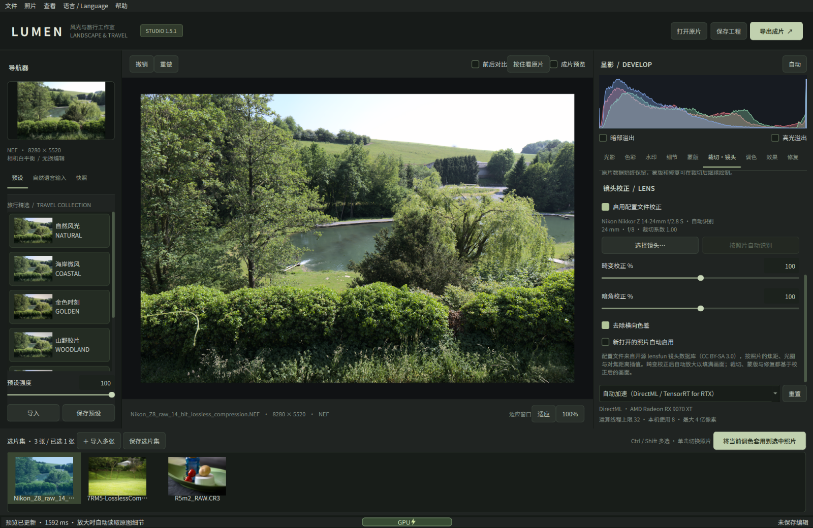
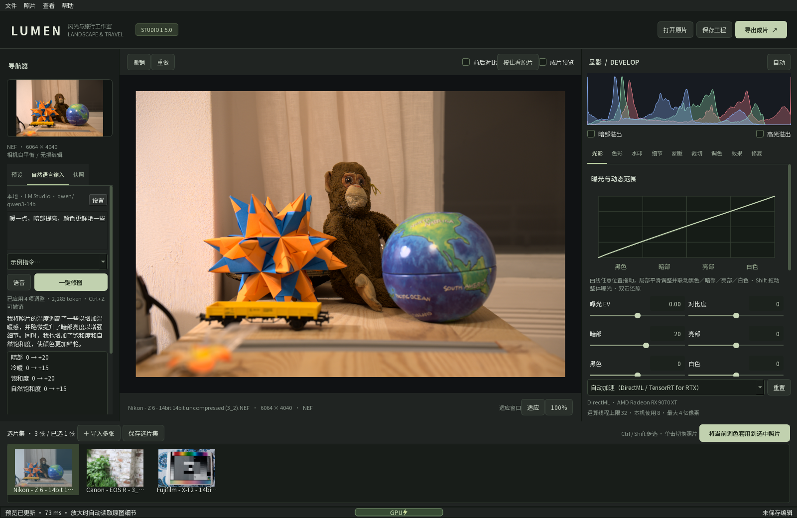

# LUMEN RAW · 多品牌 RAW 工作室

**开源 RAW 照片编辑器：调色、镜头校正、AI 增强、智能蒙版、照片合成，以及用一句话修图。**

[English](README.md) · [下载](https://github.com/hety0211/lumen-raw/releases) · [更新记录](CHANGELOG.md) · [参与贡献](CONTRIBUTING.md) · [MIT 许可证](LICENSE)

LUMEN RAW 是面向风光与旅行摄影的本地桌面编辑器，支持 Windows 和 Apple 芯片 Mac，无需账号。界面有简体中文、繁體中文、English、日本語、한국어、Deutsch、Français、Español、Русский 九种语言。打开、调色、镜头校正、AI 降噪 / 超分 / 蒙版和导出全部在本机离线完成；只有你主动使用云端大模型修图时，才会联网发送指令和参数。

当前版本 **1.5.2**（Windows，2026-10-05）。macOS 版目前为 1.5.0。



截图为实际运行界面，照片为 raw.pixls.us 的 CC0 公共测试样片（[图片来源](docs/screenshots/README.md)）。

## 下载与安装

| 系统 | 下载 | 要求 |
|---|---|---|
| Windows | [`LumenRAW-1.5.2-Setup.exe`（安装版）或 `LumenRAW-1.5.2-Windows.zip`（便携版）](https://github.com/hety0211/lumen-raw/releases/tag/v1.5.2) | Windows 10 22H2 / Windows 11，x64 |
| macOS | [`LumenRAW-1.5.0-macOS-arm64.dmg`](https://github.com/hety0211/lumen-raw/releases/tag/v1.5.0-macos) | Apple 芯片（M1 及更新），macOS 15 Sequoia 或更新 |

Mac 版 1.5.0 还没有 1.5.1 的镜头校正和多语言界面，也没有 1.5.2 对尼康 Z50 II / Z5 II 的修复，其余功能相同。两个平台的工程（`.lumen`）和选片集（`.lumenalbum`）格式相同；在 Mac 1.5.0 中打开带镜头校正的工程时，校正会被忽略。下载页附有 SHA-256 校验值。安装包都没有商业代码签名。

**Windows**

- **安装版：** 安装到当前用户目录，不需要管理员权限，可直接覆盖安装 1.2.x – 1.5.1。升级前先保存选片集并关闭旧版。安装开始时选择的语言就是软件的界面语言，之后可在「语言 / Language」菜单中更改。
- **便携版：** 解压后运行 `LumenRAW-Windows\LumenRAW.exe`。`_internal` 文件夹必须留在 exe 旁边。便携版的界面语言默认跟随系统。
- 两种包都自带 Python 运行环境、ExifTool、字体、九个 AI 模型、语音识别模型和 lensfun 镜头数据库，可完全离线使用。

**macOS**

- 双击 DMG，把 **LUMEN RAW** 拖到「应用程序」文件夹（覆盖旧版即可）。
- 安装包是临时签名，没有经过 Apple 公证，第一次打开会被拦截：点「完成」，打开「系统设置 → 隐私与安全性」，在页面下方点「仍要打开」。也可以在终端执行 `xattr -dr com.apple.quarantine "/Applications/LUMEN RAW.app"`。
- 第一次点“语音”时系统会询问麦克风权限，点「允许」。语音只在本机识别，不会上传。
- 云端 API Key 存放在登录钥匙串中。每次更新 App 后第一次使用时，macOS 会询问是否允许读取，输入开机密码并选「始终允许」即可。

## 主要功能

- **镜头校正（1.5.1）：** 按 EXIF 自动识别镜头，用开源 lensfun 数据库校正畸变、暗角和横向色差（边缘紫边／绿边）。见下方[镜头校正](#镜头校正)。
- **九种界面语言（1.5.1）：** 顶部菜单「语言 / Language」随时切换，安装程序也提供同样的九种语言。
- **一句话修图（1.5）：** 输入或说出想要的效果，你选择的本地或云端大模型返回参数，LUMEN RAW 直接应用，一步即可撤销。见下方[自然语言修图](#自然语言修图)。
- **多品牌 RAW：** Sony ARW / SR2 / SRF，Canon CRW / CR2 / CR3，Nikon NEF / NRW，Fujifilm RAF（含 X-Trans），Panasonic RW2，DNG，以及内置 LibRaw 支持的其他格式；也能打开 JPEG / PNG / TIFF。LibRaw 无法解码的尼康“高效率” NEF 改用文件内嵌的全尺寸 JPEG 打开；内置 LibRaw 尚未收录的尼康 Z50 II、Z5 II，无损 NEF 的色彩矩阵由 LUMEN RAW 补上。
- **非破坏性显影：** 曝光、对比度、亮部 / 暗部 / 白色 / 黑色，可在任意位置拖动的曝光曲线，白平衡（读取相机记录色温，带吸管），八色 HSL，RGB 与单通道曲线，三段色彩分级，黑白，暗角与颗粒。另有风光旅行预设（可调强度、可导入导出）、自动调整、快照和撤销 / 重做。
- **细节与修复：** 去薄雾、清晰度、纹理、锐化、明度 / 彩色降噪；污点修复和仿制图章。
- **蒙版：** 画笔、线性渐变、径向、亮度范围、相似颜色点选，以及本地 AI 识别的天空、人物、主体、背景、近景。可反选、羽化、调不透明度、用画笔补画或擦除，每张照片最多 32 个。
- **AI 增强：** Real-ESRGAN 2× / 4× 超分，DRUNet / NAFNet / FFDNet 去杂色。都有独立预览窗口，结果另存为可继续编辑的 DNG 副本。
- **照片合成：** 景深合成、HDR 堆栈（Mertens 曝光融合，三档去鬼影）、全景（最大 2 亿像素），每次 2–32 张。
- **选片与批量：** 一次导入多张，底部图集 Ctrl / Shift 多选；可把当前调色套用到选中照片，或批量导出 JPEG / PNG / TIFF / DNG（可设长边尺寸）。
- **大图查看：** 100% 显示原图像素，只渲染屏幕上看得见的部分；6100 万像素的照片放大调整时，界面最长停顿约 40 ms。支持前后对比、按住看原片和溢出提示。
- **水印与导出：** 四种带拍摄参数的边框水印。导出 JPEG / PNG（8 位）、TIFF（16 位）、线性 DNG（16 位），最大 4 亿像素。

## 镜头校正

右侧「裁切·镜头」面板，裁切工具下方的 **镜头校正**：

1. 打开照片后，软件按 EXIF 中的机身、镜头型号、焦距、光圈和对焦距离，在 lensfun 数据库（1569 支镜头、1057 台机身）中自动识别镜头，面板上显示识别结果和该配置文件包含哪些校正。
2. 勾选「启用配置文件校正」。「畸变校正 %」「暗角校正 %」可在 0–200% 之间调节，「去除横向色差」可单独关闭。
3. 识别不到或 EXIF 不完整时，点「选择镜头…」按品牌或型号搜索（默认只列出适合该机身卡口的镜头）；「按照片自动识别」恢复自动。勾选「新打开的照片自动启用」后，以后打开的照片默认开启校正。

- 校正参数按照片的焦距、光圈和对焦距离在数据库的标定点之间插值，并按机身裁切系数换算；全画幅机身的 APS-C 裁切模式按 EXIF 等效焦距识别。按更小画幅标定的镜头不会用于更大的画面。
- 校正在显影流程的最前面进行：暗角在线性光下校正，畸变校正后自动放大，不留空白边角。裁切、蒙版、修复、白平衡吸管和 AI 自动蒙版都基于校正后的画面；“按住看原片”和前后对比显示未校正的原片。
- 校正参数随工程保存，导出、批量导出和放大查看都会应用；“将当前调色套用到选中照片”会同步校正开关与强度，每张照片按自己的 EXIF 取得配置文件。
- 校正公式按 lensfun 公布的模型实现（不链接 lensfun 程序库），并与 lensfun 自身的计算结果核对过：色差位置误差小于 0.002 像素。

## 自然语言修图



左侧面板“预设”和“快照”之间的 **自然语言输入**：

1. 点「设置」选择模型服务（见下表），填写模型名称。可以点「获取模型列表」和「测试连接」检查。
2. 输入一句话，如“天空更蓝更有层次，整体暖一点，暗部提亮”，按 Enter 或「一键修图」。也可以从「示例指令」中选一条。
3. 模型返回的说明和每项参数变化显示在结果区。「应用强度」可在 0–150% 之间调节，「撤销本次」恢复修图前，「重新生成」从同一起点再请求一次。同一张照片保留最近三轮对话，可以接着说“再暖一点”。

模型能调整：16 个全局滑块（曝光、对比度、亮部、暗部、白色、黑色、冷暖、色调、饱和度、自然饱和度、去薄雾、清晰度、纹理、锐化、明度降噪、彩色杂点）、八色 HSL、色彩分级、暗角与颗粒、黑白、RGB 曲线，以及天空 / 主体 / 人物 / 背景 / 近景 AI 蒙版和渐变蒙版。返回的每个数值都会校验并限制在有效范围内，不会产生无效工程。指令可以用任何界面语言书写，模型按指令的语言回复说明。

| 类型 | 可选服务 | 说明 |
|---|---|---|
| 本地 | Ollama、LM Studio、llama.cpp（llama-server）、vLLM / Jan / LocalAI 等 OpenAI 兼容服务 | 不需要 API Key，数据不出本机 |
| 云端 | OpenAI、Anthropic Claude、Google Gemini、DeepSeek、阿里云百炼（通义千问）、Kimi、智谱 GLM、硅基流动、火山方舟（豆包）、OpenRouter、自定义接口 | 用你自己的 API Key，按服务商计费 |

- **发送的内容：** 指令、当前调色参数、照片的亮度 / 颜色统计和拍摄参数（机身、镜头、光圈、快门、ISO、焦距、时间，不含 GPS）。可选附带一张长边 768 像素的预览图，给支持图像输入的模型使用。
- **API Key：** 只保存在本机。Windows 上用当前用户的数据保护（DPAPI）加密，macOS 上存放在钥匙串中。
- **思考强度：** 默认 / 关闭 / 低 / 中 / 高 / 最高，自动换算成各家的参数；服务不接受时会去掉该参数重试一次。修图通常用“低”或“关闭”就够：本机 LM Studio + qwen3-14b（RX 9070 XT）一次修图，默认 11.3 秒，关闭思考 1.6 秒。模型刚加载后的第一次请求会更慢。
- **用量：** 每次修图后状态栏显示 token 用量，一次约 2,400 个。实测 DeepSeek（deepseek-flash）测试连接 1 次 + 修图 1 次共 2,486 个 token，花费不到 ¥0.01。附带预览图、多轮对话或换用其他模型时会有变化，以服务商账单为准。
- **语音：** 点「语音」或按 `Ctrl+Shift+Space`（Mac 为 `⌘⇧Space`）说话，停顿约 1 秒自动结束，识别后自动修图（可在设置中关闭）。识别使用随包的 SenseVoice-Small 模型，在本机离线运行，支持中文、英文和中英混说，6 秒语音约 0.1 秒识别完成。

## 界面语言

- 顶部菜单「语言 / Language」可选：简体中文、繁體中文、English、日本語、한국어、Deutsch、Français、Español、Русский。选择后提示重新启动，未保存的编辑会先询问保存。
- Windows 安装程序开始时的语言选择提供同样的九种语言，所选语言写入设置，安装后首次启动即为该语言；在软件中切换语言后，下次运行安装程序默认选中当前语言。没有设置时，界面语言跟随系统。
- 日文、韩文和繁体中文界面优先使用系统的对应字体，西文和俄文使用系统界面字体。

## 编辑流程

1. **导入：** 「打开原片」或把照片拖进窗口；一次可以导入多张，显示在底部图集。
2. **起步：** 选一个左侧预设、点「自动」，或用自然语言描述想要的效果；需要时在「裁切·镜头」中启用镜头校正。
3. **调整：** 右侧九个面板依次是光影、色彩、水印、细节、蒙版、裁切·镜头、调色、效果、修复。滑块数值可以直接输入，双击滑轨恢复默认。
4. **检查：** 点「100%」或用滚轮放大检查细节，按 `Y` 前后对比，按 `J` 显示溢出。
5. **保存：** `Ctrl+S` 保存当前照片的 `.lumen` 工程；「保存选片集」把图集里所有照片的编辑存入 `.lumenalbum`。两种文件都只引用原片，原片不会被修改，请和原片放在一起保管。
6. **导出：** 导出时重新读取全尺寸原片并应用全部编辑；多张照片可在图集多选后右键「批量导出」。

| 操作 | Windows | macOS |
|---|---|---|
| 导入 / 保存工程 / 导出 | `Ctrl+O` / `Ctrl+S` / `Ctrl+E` | `⌘O` / `⌘S` / `⌘E` |
| 撤销 / 重做 | `Ctrl+Z` / `Ctrl+Shift+Z` | `⌘Z` / `⌘⇧Z` |
| 适应窗口 | `Ctrl+0` | `⌘0` |
| 语音指令 | `Ctrl+Shift+Space` | `⌘⇧Space` |
| 前后对比 / 溢出提示 | `Y` / `J` | `Y` / `J` |
| 确认裁切 / 退出白平衡吸管 | `Enter` / `Esc` | `Enter` / `Esc` |
| 仿制图章取样 | `Alt` + 单击 | `Option` + 单击 |
| 平移 / 缩放 | 中键拖动 / 滚轮 | 双指滑动 / 捏合或滚轮 |

## GPU 加速

| 处理 | Windows | macOS |
|---|---|---|
| 逐像素显影（白平衡、曝光、光影、HSL、曲线、分级、黑白等） | DirectML | Metal |
| AI 模型（超分、去杂色、自动蒙版） | NVIDIA RTX 30 系及更新 + Windows 11 24H2：TensorRT for RTX；其他显卡：DirectML | Core ML（Apple GPU） |
| RAW 解码、镜头校正、去薄雾、清晰度、纹理、锐化、传统降噪、修复、合成 | CPU（最多 32 个线程） | CPU |

- GPU 结果在首次使用时与 CPU 核对，失败就自动改用 CPU。底部中间显示 `GPU⚡` 或 `CPU⚡（线程数）`，鼠标悬停可以看设备和回退原因。
- AI 模型在独立进程中运行：显卡驱动崩溃时编辑器不会关闭，会换下一种设备重算，并记住出问题的显卡与驱动组合。
- TensorRT for RTX 组件在第一次使用时由 Windows 下载，之后离线可用。
- 环境变量 `LUMEN_COMPUTE=cpu` 强制使用 CPU。在 Mac 上，`LUMEN_COREML_UNITS=ALL` 允许 Core ML 同时使用神经网络引擎。
- 实测设备：Windows 为 AMD Radeon RX 9070 XT（DirectML），另有社区用户在 GeForce RTX 5080 上测试 TensorRT for RTX；Mac 为 M1 Pro。M1 Pro 上 1600 像素预览的逐像素显影约 3–5 ms，超分和去杂色比 CPU 快 8–10 倍。1600 像素预览启用镜头校正约多 0.1 秒，只在校正参数变化时重算。

## 文件与隐私

| 内容 | Windows | macOS |
|---|---|---|
| 日志 | `%LOCALAPPDATA%\LUMEN RAW\logs` | `~/Library/Logs/LUMEN RAW` |
| 界面语言、镜头校正默认值（`settings.ini`），自然语言设置，GPU 兼容记录 | `%LOCALAPPDATA%\LUMEN RAW` | `~/Library/Application Support/LUMEN RAW` |
| API Key | 设置文件中，DPAPI 加密 | 登录钥匙串（“LUMEN RAW”） |

- 原片始终只读。编辑步骤保存在 `.lumen` / `.lumenalbum` 中；AI 和合成结果另存为新的 DNG 文件。从图集“删除”只是移出图集，不会删除磁盘上的文件。
- 只有两种情况会联网：你使用云端模型修图时，以及 Windows 第一次下载 TensorRT for RTX 组件时。从源码运行时，首次恢复资源也需要下载。镜头数据库随包提供，识别镜头不联网。
- 程序不内置相机或镜头品牌的官方图形标志；水印里的品牌文字使用通用字体。你可以导入自己有权使用的标志图片。

## 使用边界

- **镜头校正：** 只能校正 lensfun 数据库中有标定数据的镜头；有的镜头只有畸变数据，没有暗角或色差，面板会注明。变焦镜头需要照片记录焦距，暗角插值需要光圈。鱼眼镜头只校正其投影内的偏差，不转换成直线投影。没有透视（梯形）校正。相机内嵌 JPEG 和机内已校正的照片可能被重复校正，请按需开关。
- **AI 处理的对象：** AI 超分和去杂色处理的是显影后的 RGB 图像，不是传感器原始数据，也不是 Adobe 的 RAW 增强算法；超分生成的纹理可能与真实细节不同，建议先预览。
- **DNG 输出：** 导出的 DNG 是已应用编辑的 16 位线性 RGB，不是原始传感器数据的无损封装。请保留相机原片和工程文件。
- **自动选区：** 不保证精确分割发丝、树枝、半透明物体；“背景”依赖画面中有明确主体。识别后请检查紫色覆盖，用画笔修正。
- **合成：** 全景需要约 30% 以上重叠，尽量绕同一视点拍摄；大视差、运动或重复纹理可能产生接缝。HDR 是 Mertens 曝光融合，不生成辐射度 HDR。合成功能目前只用单张照片生成的受控视图测试过，真实拍摄的序列还需要更多验证。
- **尺寸与资源：**
  - 导出（含水印边框）最大 4 亿像素，2× / 4× 超分后的像素都计入。
  - 大图需要充足的内存和临时磁盘空间，建议 32 GB 内存；CPU 上的高画质 AI 可能很慢。
  - 每张照片最多 32 个蒙版、500 个修复笔划。
- **色彩：** 8 位输入按 ICC 转换到 sRGB，16 位 PNG / TIFF 按 sRGB 处理。没有相机色彩配置文件或显示器软打样。完全过曝的区域不保证能恢复。
- **界面语言：** 切换语言需要重新启动。简体中文以外的译文由开发者完成，欢迎母语用户指正用词。
- **不支持：** 不读取 Lightroom 目录或 XMP 预设。导出不完整复制原片的 EXIF / GPS。
- **已实测机型：** Sony A7 III、A7R V，Canon EOS R、R5 Mark II、Rebel SL1，Nikon Z 6、Z8、Z50 II、Z5 II，Fujifilm X-T2，Panasonic DC-S1。其他机型和压缩方式以 LibRaw 的支持范围为准。

## 从源码运行

仓库包含源码、测试、lensfun 镜头数据库、模型来源和许可证；AI 模型、字体、ExifTool 和语音模型首次运行前由 `tools/fetch_assets.py` 下载，约 830 MB。脚本会逐个核对 SHA-256，之后编辑可离线运行。

**Windows**（Python 3.12 x64）：

```powershell
git clone https://github.com/hety0211/lumen-raw.git
cd lumen-raw
py -3.12 -m venv .venv
.\.venv\Scripts\python.exe -m pip install -r requirements.txt
.\.venv\Scripts\python.exe tools/fetch_assets.py
.\.venv\Scripts\python.exe main.py
```

需要 GPU 加速时，把 ONNX Runtime 换成 Windows ML 版（内含 DirectML，RTX 显卡可用 TensorRT for RTX）：

```powershell
.\.venv\Scripts\python.exe -m pip uninstall -y onnxruntime
.\.venv\Scripts\python.exe -m pip install -r requirements-directml.txt
```

如果已经下载了资源包，可执行 `fetch_assets.py --archive 资源包路径`；`--verify-only` 只做本地校验。之后也可以用 `run-source.cmd` 启动。`requirements-gpu.txt` 提供实验性的 NVIDIA CUDA 源码环境，尚未在 NVIDIA 显卡上验证。环境变量 `LUMEN_LANGUAGE`（如 `en`、`ja`）可临时指定界面语言。

**macOS**（Apple 芯片，Python 3.12，可来自 python.org、Homebrew 或 uv）：

```bash
git clone https://github.com/hety0211/lumen-raw.git
cd lumen-raw
./run-source.command
```

首次运行会创建 `.venv-macos`，安装 `requirements-macos.txt`，并恢复资源和 Perl 版 ExifTool。Python 不在 `PATH` 时，可设置 `LUMEN_PYTHON=/path/to/python3.12`。

## 开发与构建

```powershell
.\.venv\Scripts\python.exe -m pip install -r requirements-dev.txt
.\.venv\Scripts\python.exe -m pytest tests -q
```

- **测试：** 1.5.2 的回归测试在 Windows 上 327 项通过、10 项跳过（macOS 专属等）；1.5.0 在 macOS 上 297 项通过。测试固定使用简体中文界面。实机验证记录见 [TEST_REPORT.md](TEST_REPORT.md)。
- **界面翻译：** 代码中的界面文字为简体中文原文，经 `tr()` 查找 `lumen/locales/<语言>.json`；`python tools/i18n_catalog.py` 检查各语言的缺漏和占位符。新增界面文字后请同时补充各语言的译文。
- **Windows 发布构建：** `build-release.cmd` 依次执行测试、DirectML 检查、便携版 ZIP 和 Inno Setup 安装包。
- **macOS 发布构建：** `./build-macos.command` 依次执行测试、Metal / Core ML 自检、PyInstaller、临时签名、冒烟测试和 DMG，输出在 `.publish/v<版本>/macos/`。
- **用真实照片自检：**
  - `python main.py --smoke-test 照片 输出目录`：界面、调色、蒙版、AI 预览、语音模型、一次自然语言修图、镜头校正和语言目录。
  - `--workflow-test`：多品牌导入与 AI 副本。
  - `--merge-test`：三种合成。
  - 诊断只读取原片，结果写入新的输出目录。

模型来源、转换方法、许可和校验值见 [MODEL.md](MODEL.md) 与 `assets/models/*.json`；镜头数据库的来源版本见 `assets/lensfun/README.txt`。

## 许可与致谢

程序代码以 **[MIT 许可证](LICENSE)** 发布。第三方依赖、AI 模型、语音模型（FunASR 模型协议 1.1）、lensfun 镜头数据库（CC BY-SA 3.0）、字体和 ExifTool 遵循各自的许可，见 [THIRD_PARTY.md](THIRD_PARTY.md)、[MODEL.md](MODEL.md) 和 `assets/` 中的说明。

基于 Python、PySide6 / Qt、NumPy、OpenCV、rawpy / LibRaw、Pillow、tifffile、ONNX Runtime、PyObjC 构建；镜头配置文件来自 [lensfun](https://lensfun.github.io/) 项目；模型来自 Real-ESRGAN、KAIR / DPIR、NAFNet、MiDaS、U²-Net、SkySeg、TorchVision 和 FunAudioLLM SenseVoice；安装界面翻译来自 Inno Setup。

反馈问题或贡献代码请看 [CONTRIBUTING.md](CONTRIBUTING.md)。公开分享样片前，请确认你有权分享，并去掉敏感的位置和人物信息。
